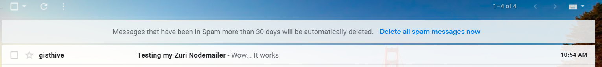
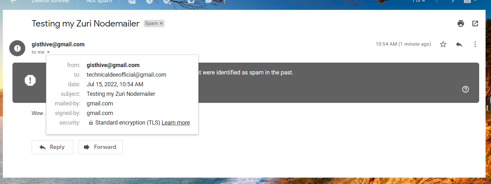
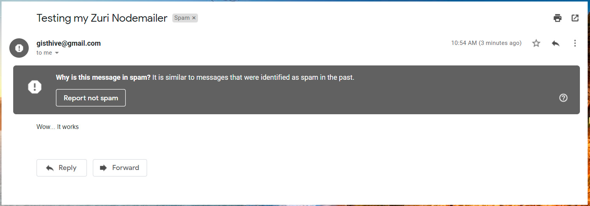

<h1>A Simple NodeMailer + NodeJS app </h1>

 Send emails using your own gmail account 

<h3 style="color: red">NOTE: You can send multiple emails by appending more emails to your 'to' property in the mailOptions object</h3>

<h3 style="color: red">NOTE: You may need to create an app password for this app. Create your own .env file to protect your passwords!</h3>

<h3> DEMO </h3>

